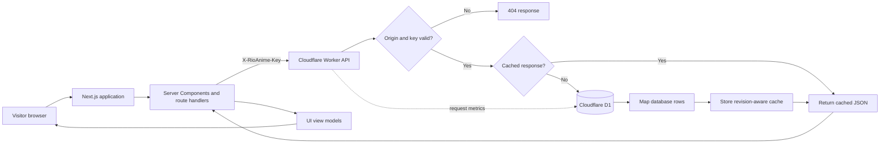
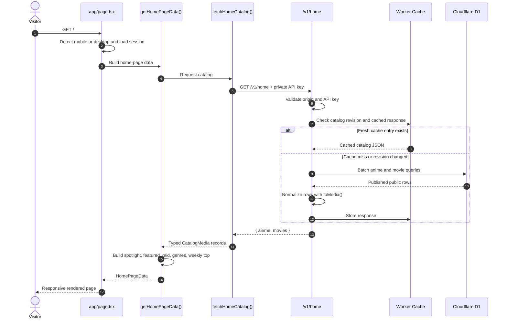
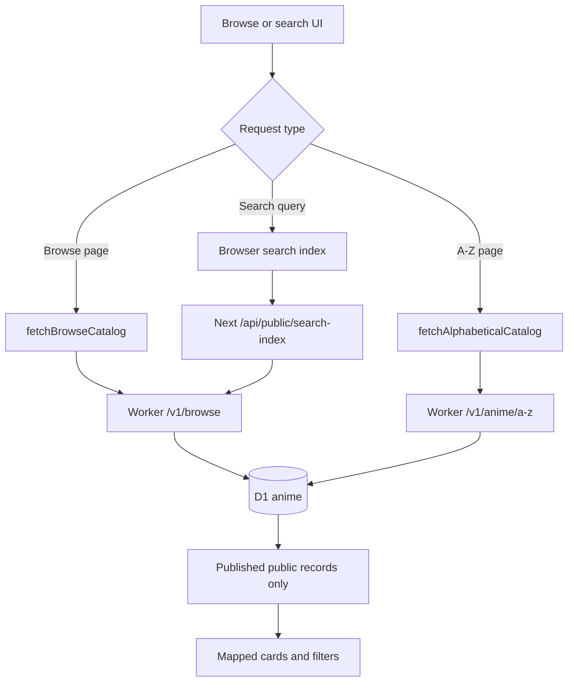
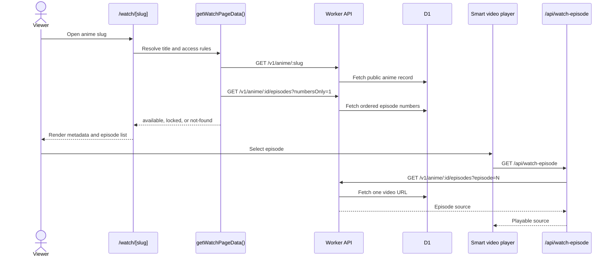
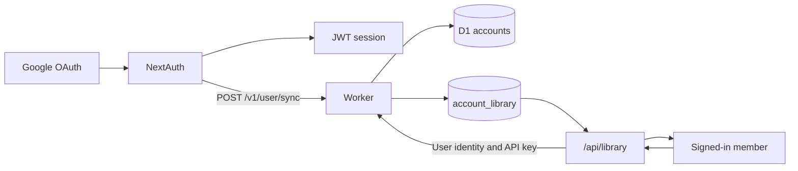
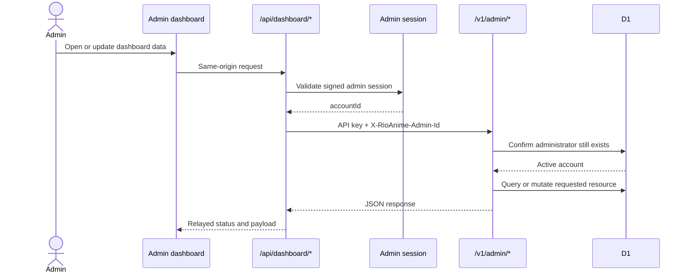
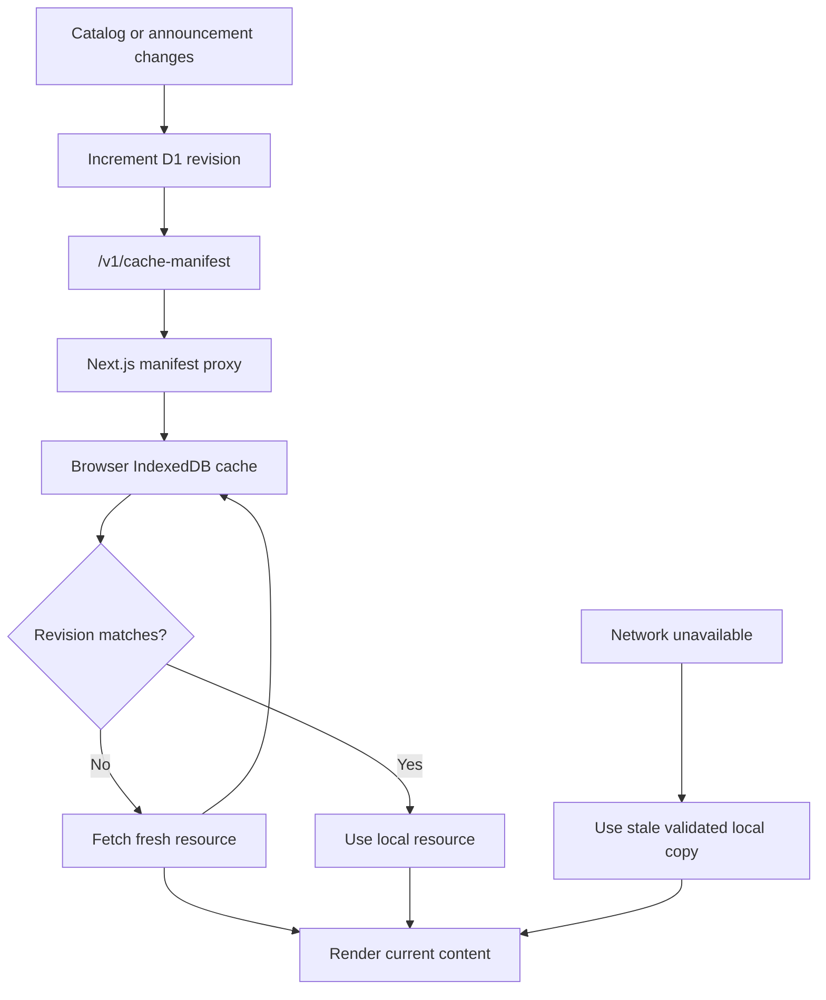
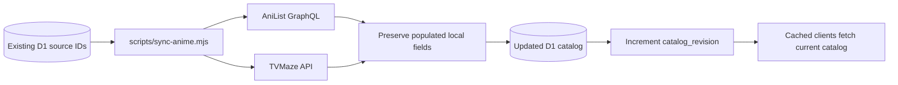

# RioAnime

<div align="center">

**A responsive anime discovery and streaming experience backed by Next.js, Cloudflare Workers, and D1.**

[](https://nextjs.org/)
[](https://react.dev/)
[](https://workers.cloudflare.com/)
[](https://developers.cloudflare.com/d1/)

Catalog discovery, search, watch pages, member libraries, announcements, and an operational admin workspace share one protected data pipeline.

</div>

---

## What RioAnime Does

RioAnime is split into two cooperating applications:

- **Next.js web application** renders the public site, handles responsive desktop/mobile experiences, manages Google authentication, and acts as a secure server-side API boundary.
- **Cloudflare Worker API** authenticates requests, applies cache policy, queries or updates D1, records operational metrics, and returns normalized JSON.

The browser never receives `RIOANIME_API_KEY` and does not connect to D1 directly. Sensitive requests pass through a Server Component, Server Action, or Next.js route handler first.

## System Overview



### Responsibility Boundaries

| Layer | Main responsibility | Important locations |
| --- | --- | --- |
| Browser | Interaction, responsive UI, local public-resource cache | `features/`, `shared/ui/`, `shared/lib/public-resource-cache.ts` |
| Next.js server | Rendering, secret isolation, authentication, response mapping | `app/`, `auth.ts`, `entities/anime/api/catalog.ts` |
| Worker | API routing, validation, cache policy, business operations | `worker.js` |
| D1 | Catalog, episodes, accounts, libraries, announcements, metrics | `migrations/` |
| Data sync | Enrich catalog records from AniList and TVMaze | `scripts/sync-anime.mjs` |

## Public Request Flow

The public site uses server-first fetching. A normal home request follows this path:



The important implementation chain is:

```text
app/page.tsx
  -> features/home/model/home-page-data.ts
  -> entities/anime/api/catalog.ts
  -> https://api.rioanime.dezely.com/v1/home
  -> worker.js:handleHome()
  -> env.DB.batch(...)
  -> Cloudflare D1
```

### How D1 Rows Become User Content

1. `handleHome`, `handleBrowse`, `handleAlphabeticalCatalog`, or `handleAnimeDetail` prepares a parameterized D1 query.
2. Public queries enforce `published`, `public`, non-deleted content through `PUBLIC_ANIME_PREDICATE`.
3. `toMedia()` converts snake-case database columns into the API's catalog shape.
4. `entities/anime/api/catalog.ts` validates the HTTP result boundary through TypeScript response types.
5. feature-level mappers convert `CatalogMedia` into focused home, browse, or watch view models.
6. React renders separate mobile and desktop experiences from the same data.

## Browse And Search Flow



- Catalog responses use a revision-aware Worker cache with a 15-minute maximum TTL.
- Search indexes use the catalog revision and browser cache for invalidation.
- Server catalog requests use Next.js revalidation unless freshness is explicitly required.
- Search ranking runs locally against the validated public index.

## Watch Flow

Watch pages intentionally separate public metadata from the playable episode source.



This keeps the Worker credential server-side and avoids placing the full episode-source catalog in the initial page payload.

## Member And Library Flow



- NextAuth owns the browser session and uses Google as the identity provider.
- A successful Google sign-in synchronizes the normalized member name and email into D1.
- The browser calls the local `/api/library` route; that route forwards trusted identity headers to the Worker.
- Library reads and writes remain authoritative in D1.

## Admin Flow

The administration workspace uses two checks: a valid local admin session and an active D1 administrator account.



The dashboard covers content, members, API keys, announcements, content notices, domain settings, activity, and live request analytics. Administrative reads are uncached so D1 remains authoritative.

## Caching Flow

RioAnime uses caching at multiple layers without allowing stale catalog data to live forever.



| Cache layer | Purpose | Invalidation |
| --- | --- | --- |
| Next.js fetch cache | Reduce repeated server-to-Worker catalog requests | Time-based revalidation or `no-store` |
| Worker response cache | Avoid repeated public D1 reads | TTL plus catalog/announcement revision |
| Browser IndexedDB | Fast repeat visits and resilient public resources | Manifest schema and revision checks |
| Admin requests | Always show authoritative operational data | `cache: "no-store"` |

## Data Synchronization Flow

The D1 catalog is authoritative at runtime. External providers enrich existing records through an explicit sync command rather than being called during visitor requests.



The sync process only fills empty or missing metadata where appropriate, preserving intentional dashboard edits.

## Observability Flow

Every authenticated Worker API response records request count, error count, total duration, and peak duration into an hourly D1 aggregate. Cache hits are included.

```text
Worker response
  -> recordRequestMetric()
  -> request_metrics_hourly
  -> /v1/dashboard and /v1/admin/analytics
  -> Next.js dashboard routes
  -> Recharts traffic and latency views
```

Writes use an hourly `(bucket_at, route)` upsert, while dashboard reads aggregate the required 24-hour, 7-day, or 30-day window.

## Project Structure

```text
rioanime/
|-- app/                         Next.js pages and server route handlers
|   |-- api/                     Browser-safe API boundary
|   |-- admin/                   Protected administration entry
|   `-- watch/[slug]/            Anime watch route
|-- entities/anime/              Catalog contracts, domain types, and mappers
|-- features/                    Home, browse, watch, account, and dashboard UI
|-- shared/                      Authentication, cache, settings, and reusable UI
|-- migrations/                  Ordered Cloudflare D1 schema changes
|-- scripts/sync-anime.mjs       AniList and TVMaze metadata synchronization
|-- worker.js                    Cloudflare Worker API and D1 access layer
|-- wrangler.jsonc               Worker, custom domain, cron, and D1 bindings
`-- auth.ts                      NextAuth and Google member synchronization
```

## Local Setup

### Prerequisites

- Node.js 20 or newer
- npm
- A Cloudflare account for Worker/D1 operations
- Google OAuth credentials for member sign-in

### Environment

Create `.env.local` with local values. Never expose these variables through `NEXT_PUBLIC_*` names.

```dotenv
RIOANIME_API_URL=http://localhost:8787
RIOANIME_API_KEY=replace-with-your-worker-api-key

AUTH_SECRET=replace-with-a-long-random-value
AUTH_GOOGLE_ID=replace-with-your-google-client-id
AUTH_GOOGLE_SECRET=replace-with-your-google-client-secret

ADMIN_SESSION_SECRET=replace-with-another-long-random-value
```

Configure these exact Google OAuth authorized redirect URIs so sign-in works from every retained site hostname:

```text
http://localhost:3000/api/auth/callback/google
https://rioanime.dezely.com/api/auth/callback/google
https://rioanimeplay.vercel.app/api/auth/callback/google
```

Configure the matching `API_KEY` Worker secret through Wrangler rather than committing it to the repository.

### Run Locally

```bash
npm install
npm run db:migrate:local
npm run worker:dev
```

In a second terminal:

```bash
npm run dev
```

Open `http://localhost:3000`.

## Commands

| Command | Purpose |
| --- | --- |
| `npm run dev` | Start the Next.js development server |
| `npm run worker:dev` | Start the local Cloudflare Worker |
| `npm run lint -- --quiet` | Run repository lint checks |
| `npm run worker:check` | Validate the Worker with a deployment dry run |
| `npm run db:migrate:local` | Apply D1 migrations locally |
| `npm run db:migrate:remote` | Apply migrations to remote D1 |
| `npm run db:sync:remote` | Enrich remote catalog data from external providers |
| `npm run worker:deploy` | Deploy the Worker to Cloudflare |

Remote migrations, synchronization, and deployment modify live infrastructure and should only be run intentionally.

## Production Topology

```text
User
  -> RioAnime Next.js site
  -> server-side API request
  -> api.rioanime.dezely.com
  -> rioanime-api Cloudflare Worker
  -> rioanime-db Cloudflare D1
```

The Worker also runs a scheduled maintenance trigger at `03:17 UTC` to purge expired retained content.

---

<div align="center">

**One catalog, one protected API boundary, and a responsive experience from database row to viewer.**

</div>
