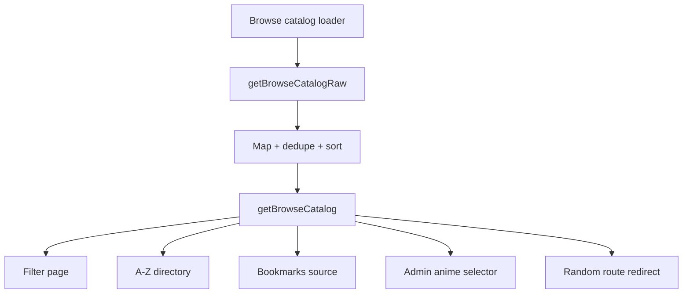

# Desktop Flow

## Purpose

This document maps the desktop-facing route composition and highlights which components own the primary public browsing experience versus the separate admin surface.

## Desktop Rendering Strategy

Desktop routes usually enter through `app/` pages, load data on the server, and render feature sections directly. For routes that support both form factors, desktop is selected by `ResponsiveRender` after the route computes an initial device guess from the request headers.

## Public Site Flow

```mermaid
flowchart TD
    A[app/page.tsx] --> B[getHomePageData()]
    B --> C[AniList fetches + mapping]
    C --> D[ResponsiveRender]
    D -->|desktop| E[DesktopHomeScreen]
    E --> F[SiteHeader]
    E --> G[FeaturedHero]
    E --> H[AnimeGrid]
    E --> I[RightSidebar]
    E --> J[SiteFooter]
```

## Browse and Directory Flow



## Watch and Admin Flow

```mermaid
flowchart TD
    A[watch/[slug] route] --> B[getWatchPageData]
    B --> C{State}
    C -->|available| D[WatchScreen]
    C -->|locked| E[WatchUnavailableScreen]
    C -->|not-found| F[next/notFound]

    G[admin/page.tsx] --> H[Admin forms]
    H --> I[Server actions]
    I --> J[updateSiteSettings]
    J --> K[data/site-settings.json]
    I --> L[revalidatePath]
```

## Desktop Ownership Notes

- `features/home/sections/desktop-home-screen.tsx` is the top-level desktop home composition root.
- `features/browse/sections/filter-toolbar.tsx` and `filter-results-panel.tsx` own the desktop filter page.
- `features/watch/sections/watch-screen.tsx` owns the desktop watch experience.
- `app/admin/page.tsx` is intentionally separate from the public desktop flow and functions as an operations console rather than a consumer-facing page.

## Notes For Changes

- Start at route entrypoints when changing data flow or route-level loading behavior.
- Start in `features/home/sections/` when adjusting desktop landing-page composition.
- Start in `features/browse/sections/` when changing the desktop catalog exploration UI.
- Keep admin changes isolated from the public browsing surface unless the change affects `site-settings.json` behavior or page revalidation.
