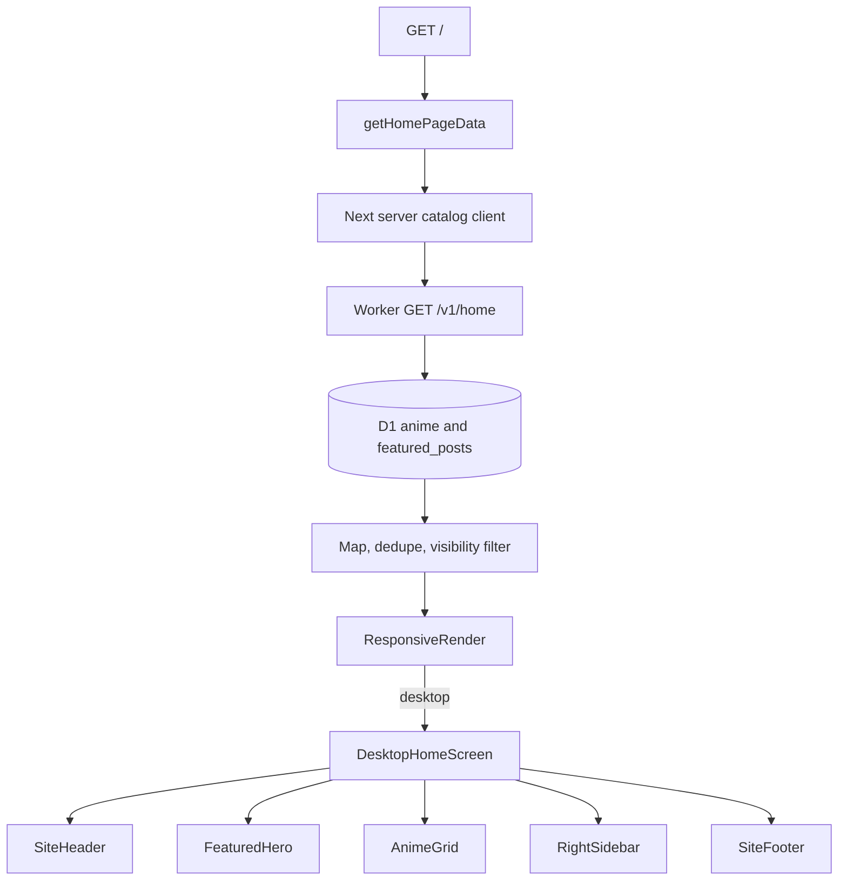
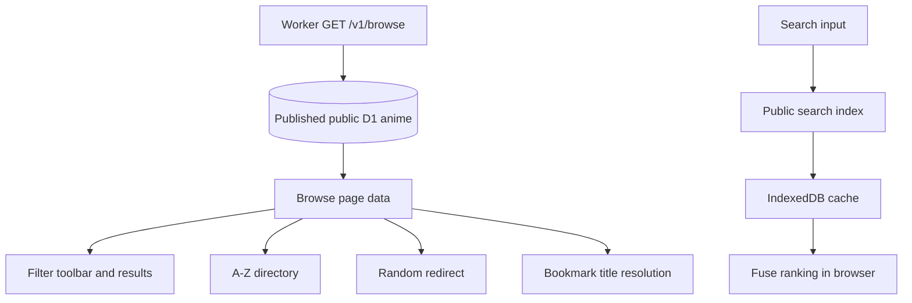
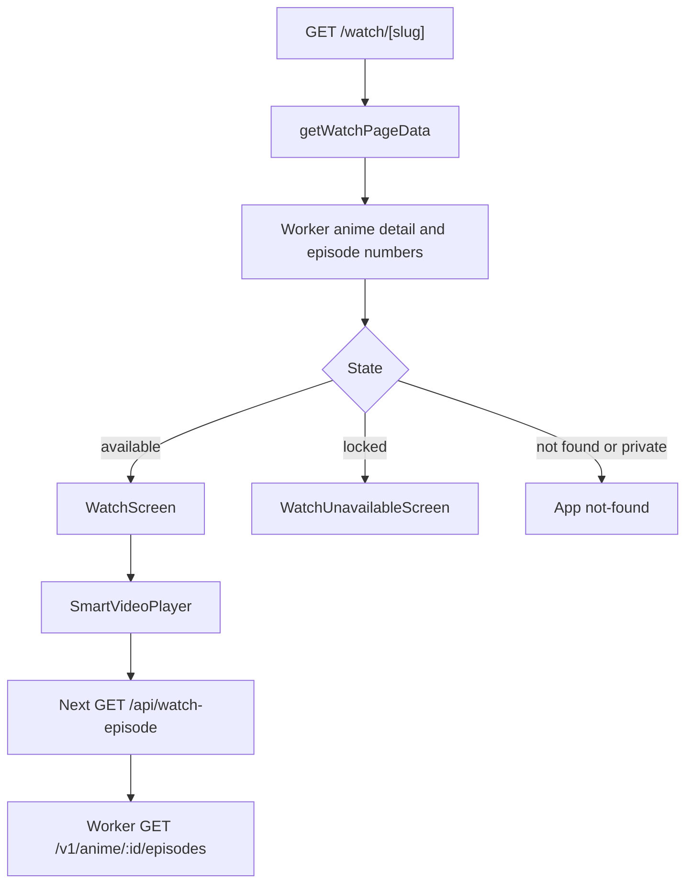
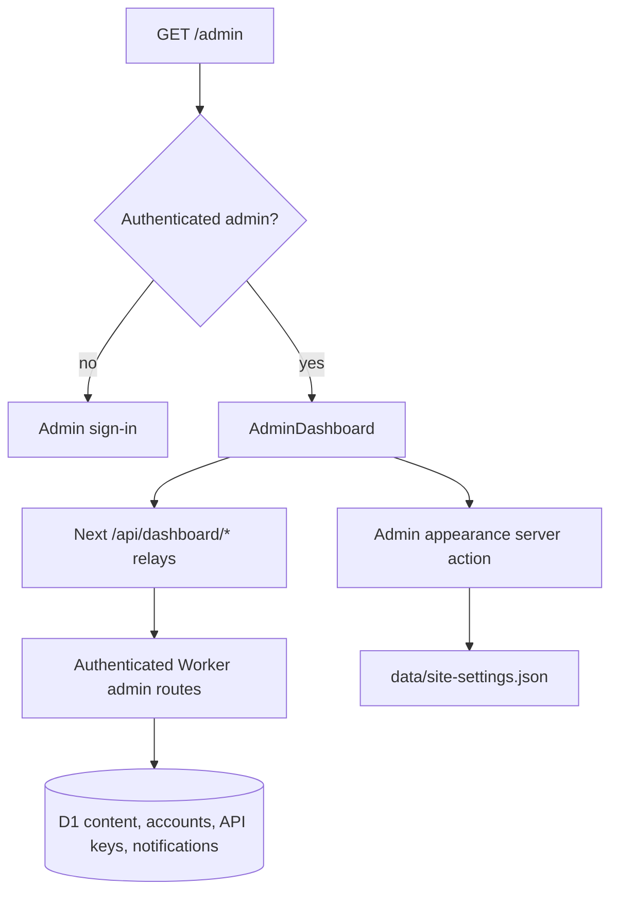

# Desktop Flow

## Purpose

This document maps the current desktop route composition, D1-backed data path, and the separate administrative console.

## Rendering Strategy

App Router pages load data on the server. Routes with distinct desktop and mobile products use request-header device detection for the first render and `ResponsiveRender` to confirm the client breakpoint. `/about` and `/home` use responsive component styling without the primary mobile app shell.

## Home Flow

`/home` is the editorial discovery route. It renders `IntroHomeScreen`, the shared navigation header, showcase content, article content, and footer from the same D1-backed home data.

## Browse And Search

Autocomplete does not call a search endpoint per keystroke. `app/api/public/search-index/route.ts` returns the compact catalog index, and `features/search/model/browser-anime-search.ts` ranks it locally.

## Watch Flow

Only the selected episode source is requested. The source proxy is an App Router endpoint and remains private and uncached.

## Admin Flow

The dashboard manages content, featured posts, members, per-key domain policies, announcements, content notices, analytics, and account settings through D1. The remaining local server action only persists the admin console appearance.

## Ownership

- `features/home/sections/desktop-home-screen.tsx` owns the desktop `/` composition.
- `features/home/sections/intro-home-screen.tsx` owns the `/home` discovery composition.
- `features/browse/sections/filter-toolbar.tsx` and `filter-results-panel.tsx` own desktop filtering.
- `features/watch/sections/watch-screen.tsx` owns desktop playback.
- `features/dashboard/admin-dashboard.tsx` owns the authenticated operations console.

## Change Guidance

- Change route loading at `app/*/page.tsx` and the corresponding feature model.
- Change desktop presentation in `features/home/sections/`, `features/browse/sections/`, or `features/watch/sections/`.
- Keep public browser reads cacheable and keep admin, account, library, and episode-source responses private.
- Add D1 changes through a new migration; never rewrite an applied migration.
