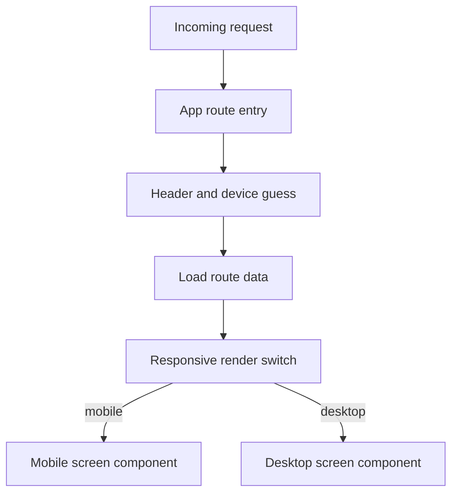
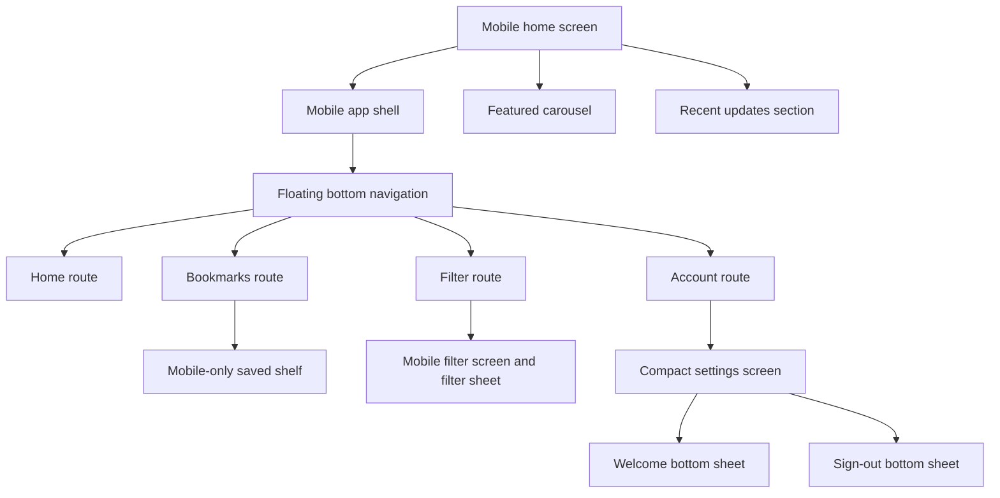
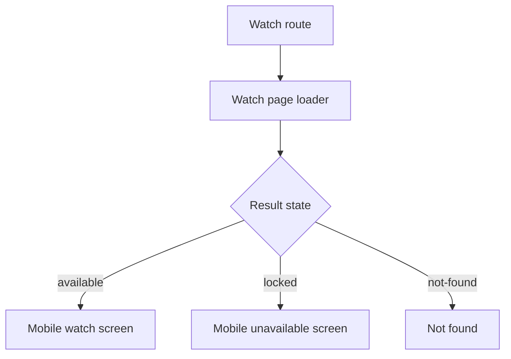

# Mobile Flow

## Purpose

This document shows how the mobile experience is assembled, where routing decisions happen, and which shared mobile primitives should be updated when the small-screen product changes.

## Mobile Rendering Strategy

The mobile experience is selected in two stages:

1. Server entrypoints estimate the device type from the incoming user agent.
2. `ResponsiveRender` confirms the viewport on the client and swaps between mobile and desktop trees.

That pattern is used by the home, filter, account, and watch routes.

## Mobile Route Flow

## Mobile Navigation Map

## Mobile Product Blueprint

Mobile is a separate product composition, not a scaled-down copy of desktop. Route loaders and storage utilities may be shared, but the screen structure, information hierarchy, and navigation can intentionally differ.

### Persistent floating navigation

- `MobileAppShell` renders `MobileBottomNav` above page content on normal mobile screens.
- The floating pill is fixed to the viewport, constrained to `332px`, and includes Home, Filter, Bookmarks, and Account.
- The active destination is the raised accent-filled circular item.
- Screens reserve bottom padding so content is not hidden behind the floating pill.
- Full-screen or bottom-sheet interactions may hide the navigation when it competes with the active task. All `AnimatedModal` instances render through a `document.body` portal at `z-[420]`, so modal backdrops and panels cover the floating navigation instead of appearing behind it.
- Bottom-aligned sheets include `env(safe-area-inset-bottom)` spacing for devices with a home indicator.

### Home (`/`)

- Mobile header uses the member avatar, a compact welcome, filter shortcut, and search.
- The content order is featured carousel, announcement strip, personalized Recent Watch or Latest Update shelf, weekly ranking, and recent updates.
- This composition belongs to `features/mobile/home/` and is intentionally distinct from the desktop hero/grid/sidebar layout.

### Bookmarks (`/bookmarks`)

- This route is currently mobile-specific and renders `MobileBookmarksScreen` directly; it does not mirror a desktop bookmarks page.
- The header includes saved totals split into total, series, and movies, plus local search and format chips.
- Up to three saved titles form a Continue Watching / Saved Queue rail with stored episode progress and Watch actions.
- Remaining titles appear in a two-column saved grid and are deliberately excluded from the rail to avoid duplicate information.
- Empty and no-extra-results states provide mobile-specific guidance and actions.

### Filter (`/filter`)

- Mobile owns a compact result header, search, applied-filter chips, pagination, and a dedicated advanced-filter bottom sheet.
- The floating navigation is hidden while the filter sheet is open.
- Recent Watch is presented as an alternate signed-in filter view using local viewing history.

### Account (`/account`)

- Mobile renders the shared settings behavior with `compact` structure inside `MobileAppShell`.
- Account cards, appearance controls, and session controls are reorganized for a narrow viewport rather than reproducing the desktop layout.
- Successful Google sign-in opens a mobile Welcome Back bottom sheet with the member avatar and one of three randomly selected messages. The URL marker is consumed so refresh does not reopen it.
- Both mobile sign-out controls open a confirmation bottom sheet before invoking the server sign-out action.
- The account sheets cover the floating navigation, close from the backdrop, close button, or Escape, and use safe-area bottom spacing.

## Mobile Watch Flow

## Shared Mobile Components

- `features/mobile/shared/mobile-app-shell.tsx` provides the high-level mobile shell.
- `features/mobile/shared/mobile-bottom-nav.tsx` owns the persistent floating bottom navigation.
- `features/mobile/shared/mobile-anime-card.tsx` is the reusable card primitive across mobile surfaces.
- `features/mobile/shared/responsive-render.tsx` is the client-side viewport switch used by mixed mobile/desktop routes.

## Notes For Changes

- If a change affects all mobile pages, start in the shared mobile shell and bottom navigation.
- If a route needs different data but the same chrome, keep the loader in the route feature and avoid moving API logic into mobile components.
- If mobile and desktop should share behavior but not structure, keep the split at the screen layer and share loaders or utility helpers instead.
